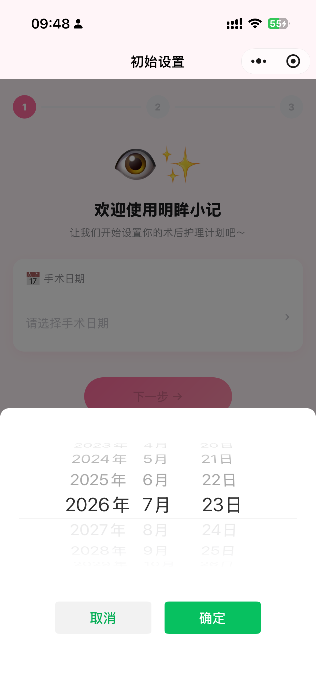
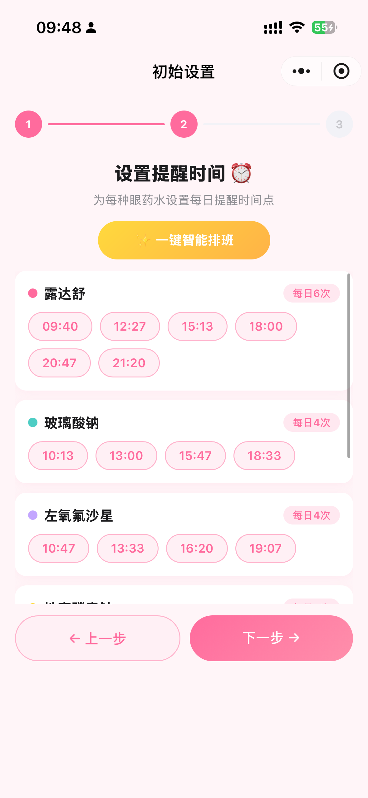
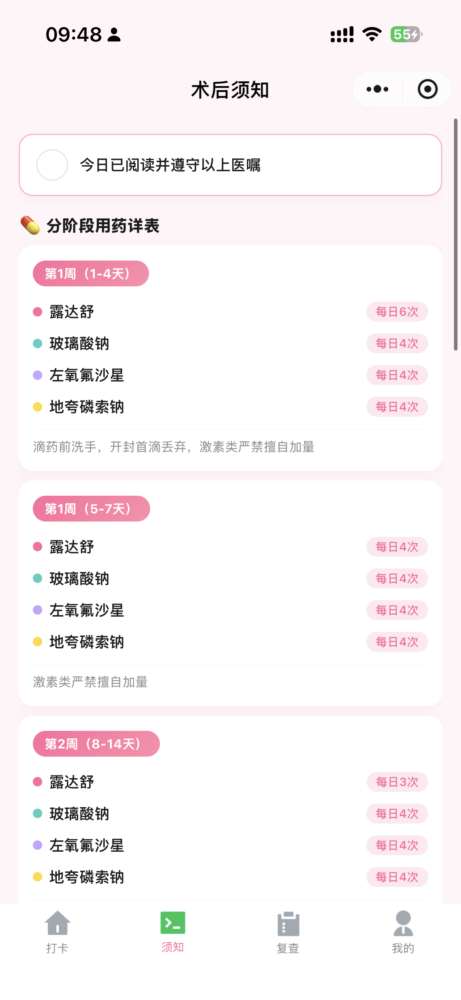
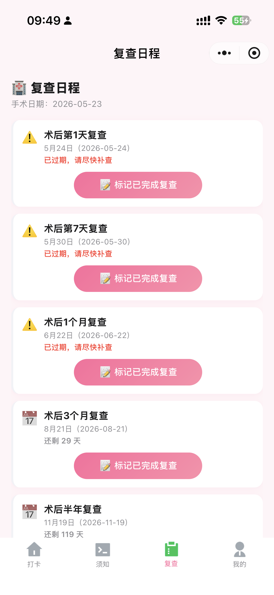
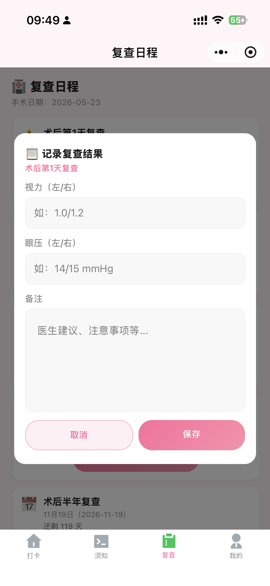
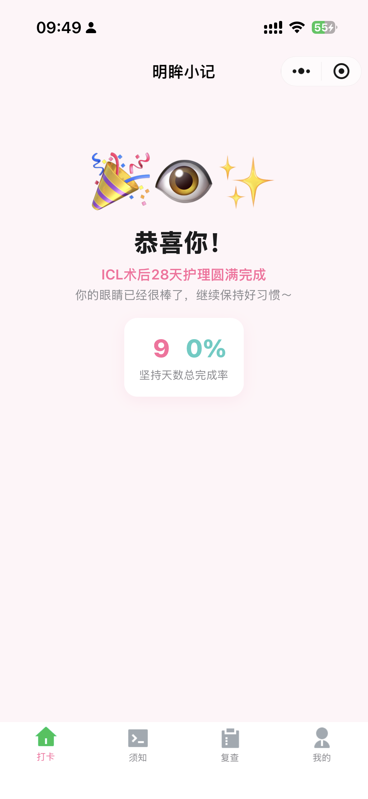
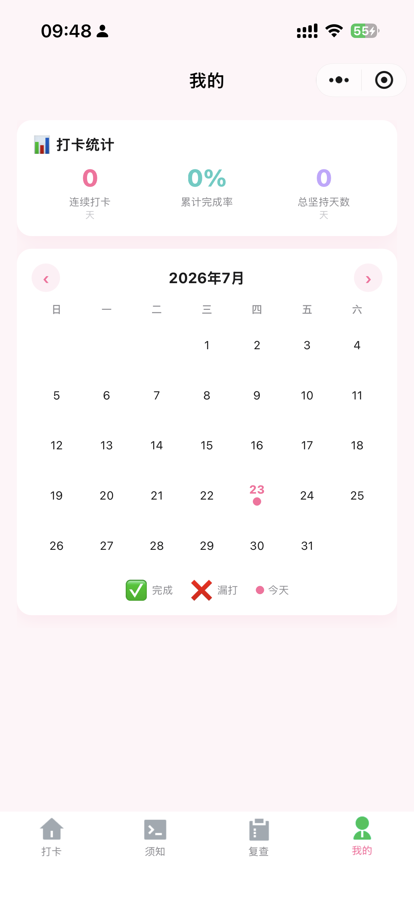
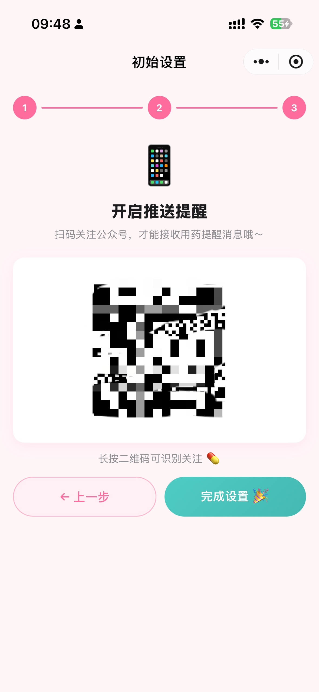

<div align="center">

# 明眸小记

**ICL 晶体植入术后护理、用药打卡与复查记录微信小程序**

把分散的医嘱、提醒和复查节点整理成每天都能执行的清单。


</div>

> 项目源于真实的家庭术后护理场景：家人完成 ICL 晶体植入手术后，需要在不同恢复阶段使用多种眼药水，并按节点复查。为了减少漏记、重复确认和纸质记录分散的问题，开发了「明眸小记」。

## 项目简介

「明眸小记」是一款基于微信小程序与微信云开发实现的个人术后健康管理辅助工具，主要覆盖 ICL 术后前 28 天的日常护理，并持续记录术后复查情况。

它可以根据手术日期计算当前恢复阶段，展示当日用药任务和护理事项，保存实际滴药时间，并统一管理术后第 1 天、第 7 天、1 个月至 1 年的复查节点。

> [!IMPORTANT]
> 本项目中的药品名称、频次、时间间隔和护理内容来自特定患者的个人医嘱，仅用于项目演示和个人记录，不能直接作为其他患者的治疗方案。实际用药及复查安排必须遵从主治医师指导。

## 功能特性

### 用药与护理

- 根据手术日期自动计算术后天数和当前恢复阶段
- 按恢复阶段显示当天需要使用的药品及次数
- 每次打卡保存实际滴药时间，避免忘记“刚才是否已经滴过”
- 展示今日完成率、未完成任务、连续打卡天数
- 支持防污水、少运动、清淡饮食、避免过度用眼等护理事项打卡
- 当日全部完成后展示庆祝提示，术后 28 天生成护理统计

### 提醒设置

- 支持一键智能安排各药品提醒时间
- 支持手动调整每次提醒的具体时间
- 自动校验不同药品之间的时间间隔
- 对需要严格间隔的药品提供单独校验
- 可通过 PushPlus 接收用药及复查提醒

### 复查记录

- 自动生成第 1 天、第 7 天、第 1 个月、第 3 个月、第 6 个月和第 1 年复查节点
- 展示复查剩余天数、当天提醒和过期提示
- 支持记录左右眼视力、眼压及医生备注
- 支持查看历史复查结果

### 数据回顾

- 月历展示每天的完成、漏打和当天状态
- 查看某一天的每种药品打卡次数及时间轴
- 汇总连续打卡、累计完成率和总坚持天数

## 页面预览

### 1. 初始化与提醒时间设置

首次使用时选择手术日期，小程序会计算当前术后天数；随后可以一键生成提醒时间，也可以按照实际作息手动调整。

<table>
  <tr>
    <td align="center"><br><sub>选择手术日期</sub></td>
    <td align="center"><br><sub>智能排班与时间调整</sub></td>
  </tr>
</table>

### 2. 术后护理须知

将分阶段用药、眼部卫生、运动限制、正常术后反应、生活禁忌和紧急就医指征集中展示，方便随时查阅。

<p align="center">
  
</p>

### 3. 复查日程与结果记录

根据手术日期自动计算各阶段复查时间，复查完成后可以记录视力、眼压和医生建议。

<table>
  <tr>
    <td align="center"><br><sub>复查日程</sub></td>
    <td align="center"><br><sub>记录复查结果</sub></td>
  </tr>
</table>

### 4. 打卡统计与历史日历

通过日历和数据看板回顾每天的完成情况，点击日期还可以查看当天每次滴药的具体时间。

<table>
  <tr>
    <td align="center"><br><sub>打卡统计</sub></td>
    <td align="center"><br><sub>历史打卡日历</sub></td>
  </tr>
</table>

### 5. 推送提醒

关注并完成 PushPlus 配置后，可接收用药和复查提醒。公开部署时请替换为自己的推送配置及二维码。

<p align="center">
  
</p>

## 使用流程

```text
选择手术日期
      ↓
生成或调整用药提醒时间
      ↓
完成推送提醒配置（可选）
      ↓
每日进行用药和护理打卡
      ↓
在日历中回顾历史记录
      ↓
按计划复查并保存检查结果
```

## 技术栈

| 类型 | 技术 |
| --- | --- |
| 客户端 | 微信原生小程序（WXML、WXSS、JavaScript） |
| 后端能力 | 微信云开发 |
| 数据存储 | 云开发数据库、本地缓存 |
| 用户识别 | 云函数获取 OpenID |
| 定时任务 | 云函数定时触发器 |
| 消息提醒 | PushPlus |

## 项目结构

```text
Bright-Eyes-Memo/
├── cloudfunctions/
│   ├── getOpenId/        # 获取当前用户 OpenID
│   ├── reminder/         # 检查用药与复查计划并发送提醒
│   └── dailyReset/       # 每日数据处理
├── image/                # README 与宣传截图
├── miniprogram/
│   ├── images/           # 小程序内部图片及 TabBar 图标
│   ├── pages/
│   │   ├── onboarding/   # 首次使用引导
│   │   ├── index/        # 每日用药与护理打卡
│   │   ├── notice/       # 术后护理须知
│   │   ├── followup/     # 复查日程与结果记录
│   │   ├── profile/      # 打卡统计与日历
│   │   ├── settings/     # 提醒时间设置
│   │   └── checkin-detail/ # 单日打卡详情
│   ├── utils/
│   │   ├── dateHelper.js
│   │   ├── medicinePhase.js
│   │   └── timeValidator.js
│   ├── app.js
│   └── app.json
├── project.config.json
└── README.md
```

## 本地运行

### 环境要求

- [微信开发者工具](https://developers.weixin.qq.com/miniprogram/dev/devtools/download.html)
- 已开通微信云开发的小程序账号
- Node.js 环境（用于安装云函数依赖）

### 导入项目

1. 克隆本仓库。
2. 打开微信开发者工具，选择“导入项目”。
3. 项目目录选择仓库根目录。
4. 填写自己的小程序 AppID，不要直接使用仓库中的测试 AppID。
5. 确认小程序目录为 `miniprogram/`，云函数目录为 `cloudfunctions/`。

### 配置云开发环境

当前源码中的云环境 ID 仅适用于原开发环境。部署自己的版本时，请修改：

```js
// miniprogram/app.js
wx.cloud.init({
  env: "你的云环境ID",
  traceUser: true
})
```

同时更新 `globalData.env`，并检查项目内其他云环境配置是否一致。

### 部署云函数

在微信开发者工具中，分别右键以下目录，选择“上传并部署：云端安装依赖”：

- `cloudfunctions/getOpenId`
- `cloudfunctions/reminder`
- `cloudfunctions/dailyReset`

定时提醒依赖云函数触发器。请根据自己的提醒精度和调用额度，在云开发控制台中配置 `reminder` 和 `dailyReset` 的定时触发规则。

### 创建数据库集合

在云开发控制台创建以下集合：

| 集合 | 用途 |
| --- | --- |
| `userConfig` | 手术日期、提醒时间及用户配置 |
| `dailyCheckin` | 每日用药、护理打卡和实际滴药时间 |
| `followupSchedule` | 复查节点及复查结果 |
| `sentReminders` | 已发送提醒的去重记录 |
| `pushStatus` | 推送服务状态记录 |

集合应配置为仅允许数据所属用户或云函数访问。正式部署前请结合当前查询方式检查 OpenID 隔离逻辑，避免不同用户之间读到彼此的配置或健康记录。

> 建议在正式部署前完整检查数据库权限，避免将个人健康记录设置为所有用户可读写。

### 配置消息推送

提醒功能使用 PushPlus。自行部署时需要：

1. 使用自己的 PushPlus 账号和 Token。
2. 在云函数环境变量中配置 `PUSHPLUS_TOKEN`，不要把 Token 写入源码。
3. 替换项目中的推送配置及二维码。
4. 不要将 Token、密钥或个人二维码提交到公开仓库。
5. 在提交代码前检查 Git 历史，确认敏感信息没有被提交过。

## 数据与隐私

本项目会涉及手术日期、用药记录、视力、眼压和医生备注等个人健康信息。公开使用或二次开发时建议：

- 数据按 OpenID 隔离，严格设置云数据库访问权限
- 不在日志中输出健康信息、Token 或其他凭据
- 二维码、测试账号和真实复查数据在截图公开前进行脱敏
- 提供数据删除和账号停用机制
- 在上线前补充隐私政策及用户授权说明

## 二次开发提示

- `miniprogram/utils/medicinePhase.js` 中的药品和频次属于个人方案，二次开发时应改为可配置数据，不应硬编码为通用模板。
- 复查节点适合根据医院要求进行配置，不同手术和患者可能存在差异。
- 若计划提供给多人使用，建议完善用户数据隔离、配置初始化、异常状态和隐私授权流程。
- PushPlus 属于第三方消息服务，提醒可能受网络、接口和公众号消息策略影响，不应承诺必达。

## 免责声明

本小程序是个人健康管理辅助工具，不具备诊断、治疗或医疗决策能力，也不能替代医生面诊、专业检查及医院出具的术后医嘱。

如出现视力突然下降、持续疼痛、明显红肿或其他异常情况，请立即联系主治医生或前往正规医疗机构就诊，不要仅依赖小程序提醒。

## 参考文档

- [微信小程序开发文档](https://developers.weixin.qq.com/miniprogram/dev/framework/)
- [微信云开发文档](https://developers.weixin.qq.com/miniprogram/dev/wxcloud/basis/getting-started.html)
- [PushPlus 官网](https://www.pushplus.plus/)
